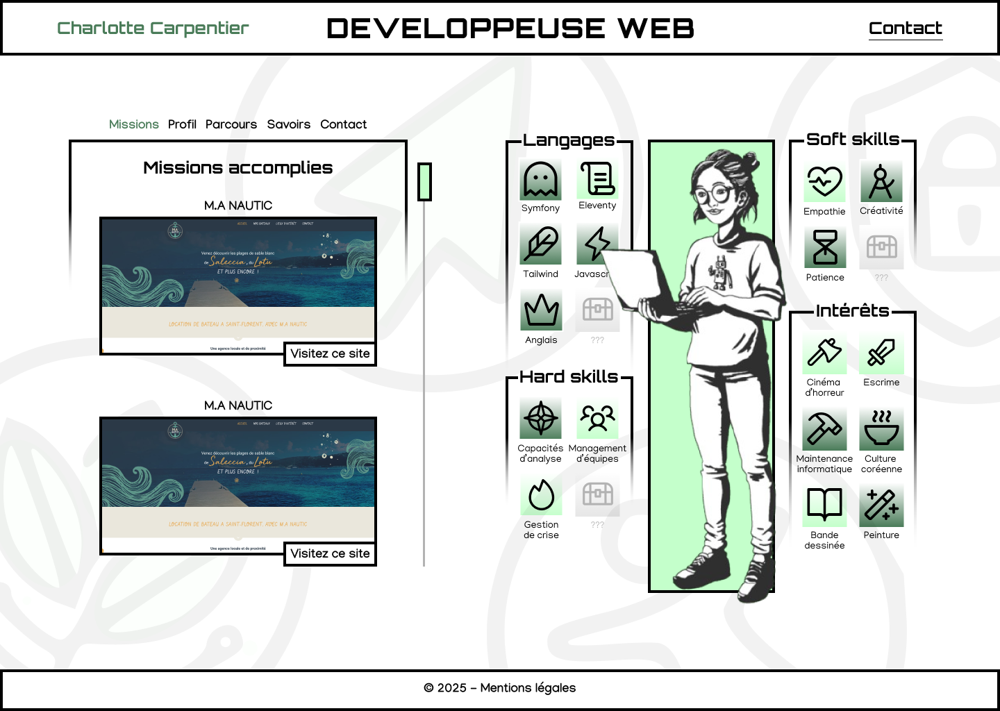

# 🎮 RPG-Style Resume — charlottecarpentier.com

> ⚔️ A unique RPG-inspired personal website showcasing skills, experience, and projects —  
> built as a fast, modular static site with a simple CMS for easy content updates.



---

## ✨ Overview

This one-page site presents your professional journey like a character sheet, featuring:

- Soft and hard skills as “stats” and “abilities”  
- Experience and education timelines  
- Project highlights  
- Avatar and interests section  
- Tabbed navigation with dynamic content

Designed to stand out and make an impression while keeping the code clean, lightweight, and maintainable.

---

## 🛠️ Tech Stack

- **Eleventy (11ty)** — static site generator  
- **Nunjucks** — templating engine  
- **Tailwind CSS v4** — single `input.css` file setup  
- **Decap CMS** — content management without a database  
- **Netlify** — deployment platform

---

## ⚙️ NPM Scripts

```json
"scripts": {
  "start": "npx concurrently \"npx @tailwindcss/cli -i ./src/input.css -o ./public/css/output.css --watch\" \"eleventy --serve --watch\"",
  "build": "npm run update-sitemap && eleventy",
  "update-sitemap": "node src/js/utils/update-sitemap.js",
  "refresh": "rm -rf .cache ./public/css/output.css"
}
````

---

## 📁 Project Structure

* `src/` — source files

  * `_data/`, `_includes/`, `js/` — organized by **OMA** (Organism, Molecule, Atom) methodology
  * `input.css` — Tailwind CSS main config
  * `admin/` — Decap CMS files
* `public/` — generated site files
* `.eleventy.js` — Eleventy config
* `robots.txt`, `sitemap.xml`, `LICENSE`, `README.md`

---

## 🚀 Getting Started

```bash
npm install
npm run start
```

Visit the site locally at [http://localhost:8080](http://localhost:8080).

---

## 📝 Content Management

Content is fully managed through **Decap CMS** (formerly Netlify CMS) at `/admin`,
allowing easy updates without a database and with automatic Git versioning.

---

## 📬 Contact & License

* Developed by Charlotte Carpentier — [carpentier.dev@gmail.com](mailto:carpentier.dev@gmail.com)
* Licensed under MIT
  

---
